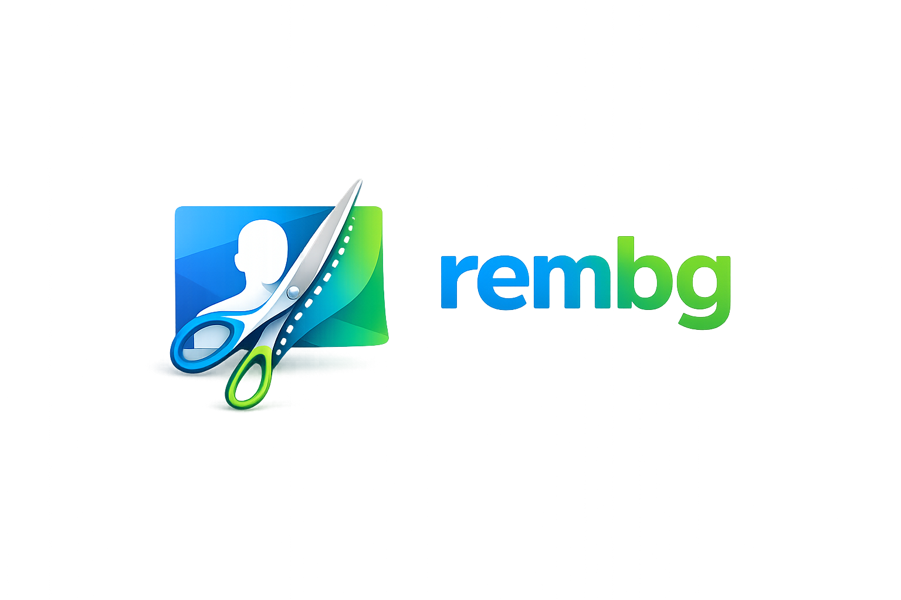
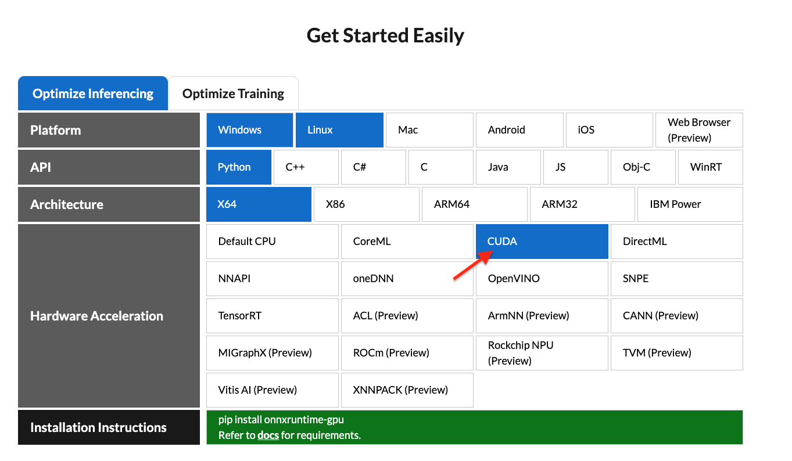

<p align="center">
  
</p>

<div align="center">
  <p align="center">Synora Studio BG Remover is a tool to remove image backgrounds. It has a highly modular architecture including a core CLI, a separate Flask Web UI, and is prepared for future desktop apps.</p>
  <div style="display: flex; flex-direction: row; justify-content: center; gap: 8px; flex-wrap: wrap; margin-top: 8px;">
    <a href="https://img.shields.io/badge/License-MIT-blue.svg"></a>
  </div>
</div>

## Architecture

This project uses an **Absolute Modular Architecture**:

- `rembg/` - The core ML engine and Headless CLI.
- `web/` - A separate Flask backend and Glassmorphic web frontend.
- `scripts/` - Cross-platform deployment and run scripts.
- `desktop/` - Reserved for future PySide6 desktop applications.

## Requirements

```text
python: >=3.12
```

### Ubuntu Manual Installation (Beginner Level)

If you are on Ubuntu, follow these step-by-step instructions to get everything running manually from scratch:

```bash
# 1. Update your system packages
sudo apt update && sudo apt upgrade -y

# 2. Install Python, pip, and git
sudo apt install python3.12 python3.12-venv python3-pip git -y

# 3. Clone the repository
git clone https://github.com/Arean82/synorastudio_bg_remove.git
cd synorastudio_bg_remove

# 4. Create and activate a virtual environment (Recommended to avoid system conflicts)
python3.12 -m venv venv
source venv/bin/activate

# 5. Install the application and all dependencies (including Swagger & Telemetry)
pip install -e .
```

### Local Installation (Developer Mode)

```bash
git clone https://github.com/Arean82/synorastudio_bg_remove.git
cd synorastudio_bg_remove
pip install -e .
```

#### How to Update
Because you installed using the `-e` (editable) flag, your Python environment directly links to these folder files. To update to the latest version, you simply pull the newest code—no need to reinstall!
```bash
git pull origin main
```

#### How to Uninstall
If you want to remove the tool and its CLI commands from your system:
```bash
pip uninstall rembg
```

### ⚖️ Developer Installation vs. Production Services

You might wonder: *If I just ran `pip install -e .`, why do I need Waitress or Nginx or Systemd Services?*

**`pip install -e .` (Developer Mode)**
- Perfect for local development, testing, and using the terminal CLI (e.g. `rembg i`).
- Runs in your active terminal. If you close the terminal, the application dies.
- Cannot handle thousands of simultaneous web requests (it runs single-threaded by default).

**Systemd Services + WSGI (Production Mode)**
- Perfect for public-facing websites or 24/7 API servers.
- Runs invisibly in the background. If your server crashes or reboots, Systemd automatically starts the app back up.
- Uses tools like Waitress or Gunicorn to spin up dozens of simultaneous worker threads to handle massive traffic without crashing.

**Verdict:** For local testing or CLI usage, `pip install -e .` is all you need. For hosting the web app or API on a server 24/7, you **must** use Systemd Services and WSGI.

### 📦 Building with PyInstaller
You can compile the separate components into standalone `.exe` files using PyInstaller! I have provided highly optimized `.spec` files for each component:

```bash
pip install pyinstaller

# Build the Headless API:
pyinstaller synora-headless-onedir.spec
pyinstaller synora-headless-onefile.spec

# Build the ML Core Engine:
pyinstaller synora-core-onedir.spec
pyinstaller synora-core-onefile.spec

# Build the Web UI:
pyinstaller synora-web-onedir.spec
pyinstaller synora-web-onefile.spec
```
This generates perfectly bundled portable `.exe` files in your `dist/` folder that require NO python installation!

### 🌐 The New Modular Architecture

Synora Studio BG Remover now natively supports an **Extensible Provider Pattern**. You can run the ML models locally, or instantly switch the UI/CLI to stream images over the network to a remote GPU server or third-party AI like Ollama!

#### 1. Dev/Test (Local Execution)

By default, if you don't set any environment variables, `web` and `headless` will load the machine learning models locally.

#### 2. Production (Distributed Execution)

Deploy the heavy `core/` to your GPU server and run its dedicated API:

```bash
python -m core.core
```

Then, on your frontend server, set the `CORE_API_URL` environment variable:

- Windows (PowerShell): `$env:CORE_API_URL="http://your-gpu-server:5051/api/remove"`
- Linux: `export CORE_API_URL="http://your-gpu-server:5051/api/remove"`

When you run `headless` or `web`, they will skip loading models and instantly proxy the image over the network!

### 📊 API Documentation & Distributed Tracing (Jaeger)

This project has built-in support for **Swagger** and **OpenTelemetry**.

- **Swagger UI**: Once you start the Core ML Engine, you can view the interactive API documentation and test endpoints directly by visiting `http://localhost:5051/apidocs/`.
- **OpenTelemetry (Jaeger)**: All modules (`core`, `web`, and `headless`) are instrumented to automatically emit traces via OTLP to `localhost:4317`. If you run a local Jaeger instance, you will see full distributed traces of your requests moving from the Web UI, over the network, into the Core ML engine!

#### 3. Third-Party AI Providers (Ollama)

You can point the UI/CLI to an entirely different AI (like a local Ollama vision model) by switching the `AI_PROVIDER` variable.

- Windows: `$env:AI_PROVIDER="ollama"`
- Linux: `export AI_PROVIDER="ollama"`
  *(You can also set `OLLAMA_URL` if it's not running on `localhost:11434`)*

### GPU support (NVIDIA/CUDA)

First, check if your system supports `onnxruntime-gpu` by visiting [onnxruntime.ai](https://onnxruntime.ai/getting-started) and reviewing the installation matrix.

<p style="display: flex;align-items: center;justify-content: center;">
  
</p>

If your system is compatible, install the optional GPU dependencies:

```bash
pip install -e ".[gpu,cli]" 
```

> **Note:** NVIDIA GPUs may require `onnxruntime-gpu`, CUDA, and `cudnn-devel`. See [#668](https://github.com/danielgatis/rembg/issues/668#issuecomment-2689830314) for details. If GPU processing doesn't work and you can't install CUDA or `cudnn-devel`, use standard CPU processing with `onnxruntime` instead.

### GPU support (AMD/ROCm)

ROCm support requires the `onnxruntime-rocm` package. Install it by following [AMD&#39;s documentation](https://rocm.docs.amd.com/projects/radeon/en/latest/docs/install/native_linux/install-onnx.html).

Once `onnxruntime-rocm` is installed and working, install the optional ROCm dependencies:

```bash
pip install -e ".[rocm,cli]" 
```

## Usage as a CLI

After installation, you can use rembg by typing `rembg` in your terminal.

The `rembg` command has 4 subcommands, one for each input type:

- `i` - single files
- `p` - folders (batch processing)
- `s` - HTTP server
- `b` - RGB24 pixel binary stream

You can get help about the main command using:

```shell
rembg --help
```

You can also get help for any subcommand:

```shell
rembg <COMMAND> --help
```

### rembg `i`

Used for processing single files.

**Remove background from a remote image:**

```shell
curl -s http://input.png | rembg i > output.png
```

**Remove background from a local file:**

```shell
rembg i path/to/input.png path/to/output.png
```

**Omit the output path** (writes `<input_stem>.out.png` next to the input):

```shell
rembg i path/to/input.png
# → path/to/input.out.png
```

If `stdout` is redirected (e.g. `rembg i input.png > out.png`), the output is written to `stdout` instead.

**Specify a model:**

```shell
rembg i -m u2netp path/to/input.png path/to/output.png
```

**Return only the mask:**

```shell
rembg i -om path/to/input.png path/to/output.png
```

**Apply alpha matting:**

```shell
rembg i -a path/to/input.png path/to/output.png
```

**Pass extra parameters (SAM example):**

```shell
rembg i -m sam -x '{ "sam_prompt": [{"type": "point", "data": [724, 740], "label": 1}] }' examples/plants-1.jpg examples/plants-1.out.png
```

**Pass extra parameters (custom model):**

```shell
rembg i -m u2net_custom -x '{"model_path": "~/.u2net/u2net.onnx"}' path/to/input.png path/to/output.png
```

### rembg `p`

Used for batch processing entire folders.

**Process all images in a folder:**

```shell
rembg p path/to/input path/to/output
```

**Watch mode (process new/changed files automatically):**

```shell
rembg p -w path/to/input path/to/output
```

### Web Application (Flask)

The web UI has been detached from the core CLI for pure modularity. To launch the modern glassmorphic web interface:

```shell
python -m web.web
```

For complete API documentation, start the Core engine and visit: `http://localhost:5051/apidocs/`

**Clean Up Script:**

If you are upgrading from an older version of Rembg and want to remove legacy Gradio setup files:

```shell
python scripts/cleanup.py
```

### rembg `b`

Process a sequence of RGB24 images from stdin. This is intended to be used with programs like FFmpeg that output RGB24 pixel data to stdout.

```shell
rembg b <width> <height> -o <output_specifier>
```

**Arguments:**

| Argument             | Description                                                                                                                                            |
| -------------------- | ------------------------------------------------------------------------------------------------------------------------------------------------------ |
| `width`            | Width of input image(s)                                                                                                                                |
| `height`           | Height of input image(s)                                                                                                                               |
| `output_specifier` | Printf-style specifier for output filenames (e.g.,`output-%03u.png` produces `output-000.png`, `output-001.png`, etc.). Omit to write to stdout. |

**Example with FFmpeg:**

```shell
ffmpeg -i input.mp4 -ss 10 -an -f rawvideo -pix_fmt rgb24 pipe:1 | rembg b 1280 720 -o folder/output-%03u.png
```

> **Note:** The width and height must match FFmpeg's output dimensions. The flags `-an -f rawvideo -pix_fmt rgb24 pipe:1` are required for FFmpeg compatibility.

## Usage as a Library

**Input and output as bytes:**

```python
from rembg import remove

with open('input.png', 'rb') as i:
    with open('output.png', 'wb') as o:
        input = i.read()
        output = remove(input)
        o.write(output)
```

**Input and output as a PIL image:**

```python
from rembg import remove
from PIL import Image

input = Image.open('input.png')
output = remove(input)
output.save('output.png')
```

**Input and output as a NumPy array:**

```python
from rembg import remove
import cv2

input = cv2.imread('input.png')
output = remove(input)
cv2.imwrite('output.png', output)
```

**Force output as bytes:**

```python
from rembg import remove

with open('input.png', 'rb') as i:
    with open('output.png', 'wb') as o:
        input = i.read()
        output = remove(input, force_return_bytes=True)
        o.write(output)
```

**Batch processing with session reuse (recommended for performance):**

```python
from pathlib import Path
from rembg import remove, new_session

session = new_session()

for file in Path('path/to/folder').glob('*.png'):
    input_path = str(file)
    output_path = str(file.parent / (file.stem + ".out.png"))

    with open(input_path, 'rb') as i:
        with open(output_path, 'wb') as o:
            input = i.read()
            output = remove(input, session=session)
            o.write(output)
```

For more examples, see the [examples](USAGE.md) page.

## Usage with Docker

### CPU Only

```shell
docker run -p 5050:5050 -v .:/data arean82/rembg
```

### NVIDIA CUDA GPU Acceleration

**Requirements:** Your host must have the [NVIDIA Container Toolkit](https://docs.nvidia.com/datacenter/cloud-native/container-toolkit/latest/install-guide.html) installed.

CUDA acceleration requires `cudnn-devel`, so you need to build the Docker image yourself. See [#668](https://github.com/danielgatis/rembg/issues/668#issuecomment-2689914205) for details.

**Build the image:**

```shell
docker build -t rembg-nvidia-cuda-cudnn-gpu -f Dockerfile_nvidia_cuda_cudnn_gpu .
```

> **Note:** This image requires ~11GB of disk space (CPU version is ~1.6GB). Models are not included.

**Run the container:**

```shell
sudo docker run --rm -it --gpus all -p 5050:5050 -v /dev/dri:/dev/dri -v $PWD:/data rembg-nvidia-cuda-cudnn-gpu
```

**Tips:**

- You can create your own NVIDIA CUDA image and install `rembg[gpu,cli]` in it.
- Use `-v /path/to/models/:/root/.u2net` to store model files outside the container, avoiding re-downloads.

## Models

All models are automatically downloaded and saved to `~/.u2net/` on first use.

### Available Models

- u2net ([download](https://github.com/danielgatis/rembg/releases/download/v0.0.0/u2net.onnx), [source](https://github.com/xuebinqin/U-2-Net)): A pre-trained model for general use cases.
- u2netp ([download](https://github.com/danielgatis/rembg/releases/download/v0.0.0/u2netp.onnx), [source](https://github.com/xuebinqin/U-2-Net)): A lightweight version of u2net model.
- u2net_human_seg ([download](https://github.com/danielgatis/rembg/releases/download/v0.0.0/u2net_human_seg.onnx), [source](https://github.com/xuebinqin/U-2-Net)): A pre-trained model for human segmentation.
- u2net_cloth_seg ([download](https://github.com/danielgatis/rembg/releases/download/v0.0.0/u2net_cloth_seg.onnx), [source](https://github.com/levindabhi/cloth-segmentation)): A pre-trained model for Cloths Parsing from human portrait. Here clothes are parsed into 3 category: Upper body, Lower body and Full body.
- silueta ([download](https://github.com/danielgatis/rembg/releases/download/v0.0.0/silueta.onnx), [source](https://github.com/xuebinqin/U-2-Net/issues/295)): Same as u2net but the size is reduced to 43Mb.
- isnet-general-use ([download](https://github.com/danielgatis/rembg/releases/download/v0.0.0/isnet-general-use.onnx), [source](https://github.com/xuebinqin/DIS)): A new pre-trained model for general use cases.
- isnet-anime ([download](https://github.com/danielgatis/rembg/releases/download/v0.0.0/isnet-anime.onnx), [source](https://github.com/SkyTNT/anime-segmentation)): A high-accuracy segmentation for anime character.
- sam ([download encoder](https://github.com/danielgatis/rembg/releases/download/v0.0.0/vit_b-encoder-quant.onnx), [download decoder](https://github.com/danielgatis/rembg/releases/download/v0.0.0/vit_b-decoder-quant.onnx), [source](https://github.com/facebookresearch/segment-anything)): A pre-trained model for any use cases.
- birefnet-general ([download](https://github.com/danielgatis/rembg/releases/download/v0.0.0/BiRefNet-general-epoch_244.onnx), [source](https://github.com/ZhengPeng7/BiRefNet)): A pre-trained model for general use cases.
- birefnet-general-lite ([download](https://github.com/danielgatis/rembg/releases/download/v0.0.0/BiRefNet-general-bb_swin_v1_tiny-epoch_232.onnx), [source](https://github.com/ZhengPeng7/BiRefNet)): A light pre-trained model for general use cases.
- birefnet-portrait ([download](https://github.com/danielgatis/rembg/releases/download/v0.0.0/BiRefNet-portrait-epoch_150.onnx), [source](https://github.com/ZhengPeng7/BiRefNet)): A pre-trained model for human portraits.
- birefnet-dis ([download](https://github.com/danielgatis/rembg/releases/download/v0.0.0/BiRefNet-DIS-epoch_590.onnx), [source](https://github.com/ZhengPeng7/BiRefNet)): A pre-trained model for dichotomous image segmentation (DIS).
- birefnet-hrsod ([download](https://github.com/danielgatis/rembg/releases/download/v0.0.0/BiRefNet-HRSOD_DHU-epoch_115.onnx), [source](https://github.com/ZhengPeng7/BiRefNet)): A pre-trained model for high-resolution salient object detection (HRSOD).
- birefnet-cod ([download](https://github.com/danielgatis/rembg/releases/download/v0.0.0/BiRefNet-COD-epoch_125.onnx), [source](https://github.com/ZhengPeng7/BiRefNet)): A pre-trained model for concealed object detection (COD).
- birefnet-massive ([download](https://github.com/danielgatis/rembg/releases/download/v0.0.0/BiRefNet-massive-TR_DIS5K_TR_TEs-epoch_420.onnx), [source](https://github.com/ZhengPeng7/BiRefNet)): A pre-trained model with massive dataset.
- bria-rmbg ([download](https://github.com/danielgatis/rembg/releases/download/v0.0.0/bria-rmbg-2.0.onnx), [source](https://huggingface.co/briaai/RMBG-2.0)): A state-of-the-art background removal model by BRIA AI.

## Environment Variables

| Variable                    | Description                                                                                                                                                                                                         |
| --------------------------- | ------------------------------------------------------------------------------------------------------------------------------------------------------------------------------------------------------------------- |
| `U2NET_HOME`              | Path to the directory where models are stored. Defaults to `$XDG_DATA_HOME/.u2net` (or `~/.u2net` if `XDG_DATA_HOME` is not set).                                                                             |
| `XDG_DATA_HOME`           | Base data directory used when `U2NET_HOME` is not set. Defaults to `~`.                                                                                                                                         |
| `MODEL_CHECKSUM_DISABLED` | When set (e.g.`MODEL_CHECKSUM_DISABLED=1`), disables hash verification for downloaded models. This is useful if you want to use your own custom/converted model files without rembg re-downloading the originals. |
| `OMP_NUM_THREADS`         | Sets the number of threads used by ONNX Runtime for inference.                                                                                                                                                      |

### Using custom model files

If you need to use a modified version of a model (e.g. converted to a different ONNX IR version for compatibility with an older CUDA toolkit), you can prevent rembg from overwriting it:

1. Set `MODEL_CHECKSUM_DISABLED=1`
2. Place your custom `.onnx` file in the models directory (`~/.u2net/` by default) with the expected filename (e.g. `u2net.onnx`)
3. Rembg will detect the file exists and use it without re-downloading

## FAQ

### When will this library support Python version 3.xx?

This library depends on [onnxruntime](https://pypi.org/project/onnxruntime). Python version support is determined by onnxruntime's compatibility.

## Support

If you find this project useful, consider sponsoring the project on GitHub.

## Star History

[](https://star-history.com/#danielgatis/rembg&Date)

## License

Copyright (c) 2020-present [Daniel Gatis](https://github.com/danielgatis)

Licensed under the [MIT License](./LICENSE.txt).
